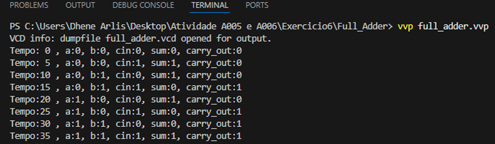
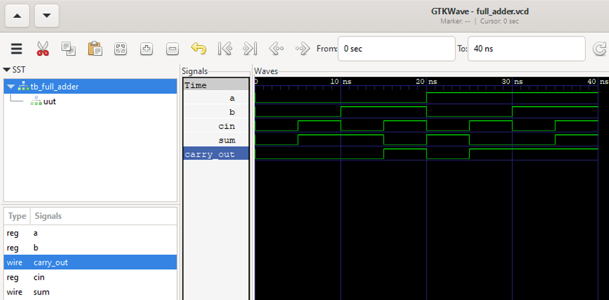

# 🔁 Full Adder (Somador Completo) de 1 bit
Este projeto apresenta a implementação comportamental de um somador completo (full adder) de 1 bit em Verilog. 
Inclui o módulo de design, um testbench abrangente, simulação com Icarus Verilog e análise de formas de onda com GTKWave. 
O circuito soma três bits de entrada e gera os bits de soma e transporte de saída, sendo um bloco fundamental para a construção de somadores de múltiplos bits.

---

## 📖 Visão Geral

Um **full adder** (somador completo) é um circuito combinacional que realiza a soma de três bits:

**Entradas:**  
- `a` – primeiro bit a ser somado  
- `b` – segundo bit a ser somado  
- `cin` (carry-in) – bit de transporte vindo de um estágio anterior  

**Saídas:**  
- `sum` – bit menos significativo da soma  
- `carry_out` (carry-out) – bit de transporte gerado para o próximo estágio  

**Expressões booleanas:**  

```text 
sum        = a ⊕ b ⊕ cin
carry_out  = (a & b) | (cin & (a ⊕ b))
```

```text 
Essas equações podem ser implementadas com portas lógicas XOR, AND e OR, conforme o código Verilog apresentado.
```
---


## 🔢 Tabela Verdade

| a | b | cin | sum | carry_out |
|---|---|---|---|---|
| 0 | 0 | 0 | 0 | 0 |
| 0 | 0 | 1 | 1 | 0 |
| 0 | 1 | 0 | 1 | 0 |
| 0 | 1 | 1 | 0 | 1 |
| 1 | 0 | 0 | 1 | 0 |
| 1 | 0 | 1 | 0 | 1 |
| 1 | 1 | 0 | 0 | 1 |
| 1 | 1 | 1 | 1 | 1 |


## 🧪 Testbench (tb_full_adder)
O testbench instancia o módulo full_adder e aplica **todas as oito combinações possíveis de entrada**, com intervalo de 5 ns entre cada vetor de teste. O monitor $monitor exibe os valores no console e o arquivo .vcd registra todas as transições para análise posterior.

## 🧪 Estímulos Aplicados no Testbench

| Período (ns) | a | b | cin | sum | carry_out |
|---|---|---|---|---|---|
| 0–5 | 0 | 0 | 0 | 0 | 0 |
| 5–10 | 0 | 0 | 1 | 1 | 0 |
| 10–15 | 0 | 1 | 0 | 1 | 0 |
| 15–20 | 0 | 1 | 1 | 0 | 1 |
| 20–25 | 1 | 0 | 0 | 1 | 0 |
| 25–30 | 1 | 0 | 1 | 0 | 1 |
| 30–35 | 1 | 1 | 0 | 0 | 1 |
| 35–40 | 1 | 1 | 1 | 1 | 1 |


---

## 🚀 Simulação com Icarus Verilog
O projeto foi compilado e simulado usando Icarus Verilog dentro do Visual Studio Code (com extensão TerosHDL). 
A simulação produz um arquivo .vcd contendo todas as transições dos sinais.

``` bash
# Compilar módulo + testbench (gera o .vvp)
iverilog -o full_adder.vvp full_adder.v tb_full_adder.v

# Executar simulação
vvp full_adder.vvp
```

A saída no console exibe os valores monitorados, confirmando o comportamento esperado.

<p align="center">  <br> <em>Execução da simulação no VS Code mostrando a saída do console.</em> </p>

---

## 📊 Análise de Formas de Onda com GTKWave

``` bash
# Visualizar forma de onda
gtkwave full_adder.vcd
```

O arquivo VCD gerado foi aberto no GTKWave para verificar visualmente a temporização e a lógica do circuito.

<p align="center">  <br> <em>Visualização no GTKWave mostrando todas as combinações de entrada e as respectivas saídas.</em> </p>
A forma de onda reproduz fielmente a tabela verdade, com as transições ocorrendo nos instantes esperados.

---

## ⚙️ Análise dos Resultados
As saídas sum e carry_out para todas as combinações de entrada correspondem exatamente à tabela verdade, conforme verificado no console e nas formas de onda. 
A simulação confirma o funcionamento correto do circuito, validando a implementação comportamental proposta.


---

## ✅ Conclusão
O somador completo de 1 bit foi implementado com sucesso em Verilog utilizando uma descrição comportamental simples e direta. 
A simulação com Icarus Verilog e a visualização no GTKWave comprovam que o circuito atende à tabela verdade esperada. Este módulo pode ser facilmente integrado em projetos maiores, como somadores de múltiplos bits (somador ripple‑carry) ou unidades lógicas aritméticas.
