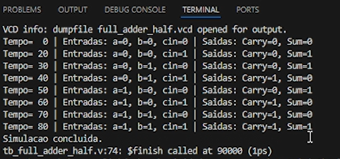
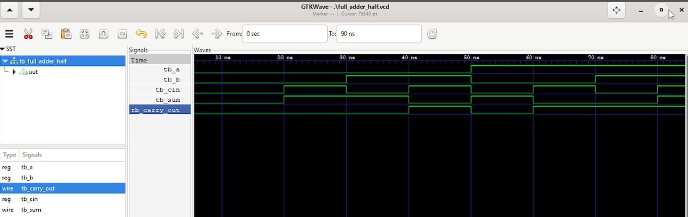

# 🔁 Full Adder Estrutural com Half Adders (1 bit)

Este projeto apresenta a implementação estrutural de um somador completo (full adder) de 1 bit utilizando dois módulos half adder e uma porta OR em Verilog.
O circuito soma três bits de entrada (a, b e cin) e produz as saídas sum e carry_out.
A implementação demonstra o conceito de hierarquia e reutilização de módulos em projetos digitais.

---

## 📖 Visão Geral

Um **full adder** (somador completo) é um circuito combinacional que realiza a soma de três bits:

**Entradas:**  
- `a` – primeiro bit a ser somado  
- `b` – segundo bit a ser somado  
- `cin` (carry-in) – bit de transporte vindo de um estágio anterior  

**Saídas:**  
- `sum` – bit menos significativo da soma  
- `carry_out` (carry-out) – bit de transporte gerado para o próximo estágio  

### Implementação Estrutural

Nesta versão, o full adder é construído a partir de:

1. **Dois half adders** - cada um realiza a soma de dois bits, gerando uma soma intermediária (sum) e um carry (carry).
2. **Uma porta OR** para combinar os carries intermediários e prouz o carry de saída.

**Conexões:**

- O primeiro half adder (uut1) soma a e b, gerando sum_1 e carry_1.
- O segundo half adder (uut2) soma sum_1 e cin, gerando sum (saída final) e carry_2.
- A porta OR combina carry_1 e carry_2 para formar carry_out.

Essa abordagem demonstra o conceito de **modularidade e reutilização de módulos** em Verilog.

---

## 🔢 Tabela Verdade

A tabela verdade do full adder é a seguinte:

| a | b | cin | sum | carry_out |
|---|---|---|---|---|
| 0 | 0 | 0 | 0 | 0 |
| 0 | 0 | 1 | 1 | 0 |
| 0 | 1 | 0 | 1 | 0 |
| 0 | 1 | 1 | 0 | 1 |
| 1 | 0 | 0 | 1 | 0 |
| 1 | 0 | 1 | 0 | 1 |
| 1 | 1 | 0 | 0 | 1 |
| 1 | 1 | 1 | 1 | 1 |

---

## 🧪 Testbench (`tb_full_adder_half`)

O testbench instancia o módulo `full_adder_half` e aplica **todas as oito combinações possíveis** de entrada, com intervalo de 10 ns entre cada vetor de teste. O monitor `$monitor` exibe os valores no console e o arquivo `.vcd` registra todas as transições para análise posterior.

### Estímulos Aplicados

| Período (ns) | a | b | cin | sum | carry_out |
|---|---|---|---|---|---|
| 0–10         | 0 | 0 | 0   | 0   | 0         |
| 10–20        | 0 | 0 | 1   | 1   | 0         |
| 20–30        | 0 | 1 | 0   | 1   | 0         |
| 30–40        | 0 | 1 | 1   | 0   | 1         |
| 40–50        | 1 | 0 | 0   | 1   | 0         |
| 50–60        | 1 | 0 | 1   | 0   | 1         |
| 60–70        | 1 | 1 | 0   | 0   | 1         |
| 70–80        | 1 | 1 | 1   | 1   | 1         |

---
## 🚀 Simulação com Icarus Verilog
O projeto foi compilado e simulado usando Icarus Verilog dentro do Visual Studio Code (com extensão TerosHDL). 
A simulação produz um arquivo .vcd contendo todas as transições dos sinais.

```bash
# Compilar módulos + testbench (half_adder.v, full_adder_half.v, tb_full_adder_half.v)
iverilog -o full_adder_half.vvp half_adder.v full_adder_half.v tb_full_adder_half.v

# Executar simulação
vvp full_adder_half.vvp
```

A saída no console exibe os valores monitorados, confirmando o comportamento esperado.

<p align="center">  <br> 
  <em>Execução da simulação no VS Code mostrando a saída do console.</em> </p>

## 📊 Análise de Formas de Onda com GTKWave

```bash
# Visualizar forma de onda
gtkwave full_adder_half.vcd
```
O arquivo VCD gerado foi aberto no GTKWave para verificar visualmente a temporização e a lógica do circuito.

<p align="center">  <br> <em>Visualização no GTKWave mostrando todas as combinações de entrada e as respectivas saídas.</em> </p>
A forma de onda reproduz fielmente a tabela verdade, com as transições ocorrendo nos instantes esperados (a cada 10 ns).


## ⚙️ Análise dos Resultados

As saídas sum e carry_out para todas as combinações de entrada correspondem exatamente à tabela verdade, conforme verificado no console e nas formas de onda. 
A simulação no terminal e as formas de onda no GTKWave validam a correta interconexão dos dois half adders e da porta OR.
A implementação estrutural demonstra a reutilização de componentes e a hierarquia de projetos em Verilog.

## ✅ Conclusão

O full adder de 1 bit foi implementado com sucesso utilizando dois half adders e uma porta OR. A simulação com Icarus Verilog e a visualização no GTKWave comprovam o funcionamento lógico esperado. Este exercício reforça a importância da modularidade e da validação de circuitos digitais, permitindo a construção de sistemas mais complexos a partir de blocos básicos.


