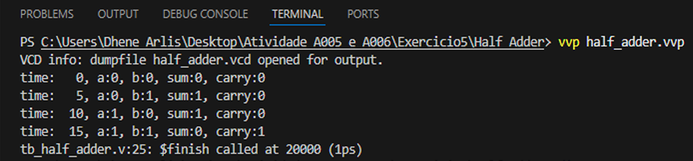
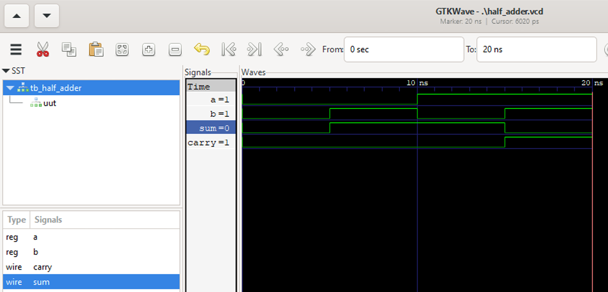

# 🔁 Half Adder (Meio Somador) de 1 bit 

Este projeto apresenta a **implementação comportamental de um meio somador** em Verilog. Inclui o módulo de design, um testbench abrangente, simulação com Icarus Verilog e análise de formas de onda usando GTKWave. O trabalho está estruturado para ser facilmente integrado em sistemas digitais maiores, como somadores completos ou unidades lógicas aritméticas.

---

## 📖 Visão Geral

Um meio somador é um circuito combinacional fundamental que soma dois números binários de um bit. Ele produz duas saídas:

- **sum** – o bit menos significativo da adição.
- **carry** – o bit que se propaga para o próximo dígito mais significativo.

As expressões booleanas que regem seu funcionamento são:

- `sum   = a ⊕ b`  (XOR)
- `carry = a · b`  (AND)

Estas podem ser implementadas diretamente com uma porta XOR e uma porta AND.

---

## 🔢 Tabela Verdade

| Entrada `a` | Entrada `b` | Saída `sum` | Saída `carry` |
|:-----------:|:-----------:|:-----------:|:-------------:|
| 0           | 0           | 0           | 0             |
| 0           | 1           | 1           | 0             |
| 1           | 0           | 1           | 0             |
| 1           | 1           | 0           | 1             |

---


## 🧪 Testbench (tb_half_adder)
O testbench instancia o módulo half_adder e aplica todas as combinações possíveis de entrada (00, 01, 10, 11), com intervalo de 5 ns entre cada vetor de teste. 

Estímulos aplicados

| Tempo (ns) | a | b | sum | carry |
|------------|---|---|-----|-------|
| 0          | 0 | 0 | 0   | 0     |
| 5          | 0 | 1 | 1   | 0     |
| 10         | 1 | 0 | 1   | 0     |
| 15         | 1 | 1 | 0   | 1     |


---

## 🚀 Simulação com Icarus Verilog

O projeto foi compilado e simulado usando Icarus Verilog dentro do Visual Studio Code (com a extensão TerosHDL). A simulação produz um arquivo VCD contendo todas as transições dos sinais.

```bash
# Compilar
iverilog -o half_adder.vvp half_adder.v tb_half_adder.v

# Executar simulação
vvp half_adder.vvp

```
A saída da simulação (console e arquivo half_adder.vcd gerado) confirma o comportamento correto.

<p align="center">  <br> <em>Execução da simulação no VS Code mostrando a saída do console.</em> </p>

---

## 📊 Análise de Formas de Onda com GTKWave
O arquivo VCD gerado foi aberto no GTKWave para verificar visualmente o tempo e a lógica.

<p align="center">  <br> <em>Visualização no GTKWave mostrando todas as combinações de entrada e as respectivas saídas.</em> </p>
A forma de onda mostra claramente:

Em 0–5 ns: a=0, b=0 → sum=0, carry=0

Em 5–10 ns: a=0, b=1 → sum=1, carry=0

Em 10–15 ns: a=1, b=0 → sum=1, carry=0

Em 15–20 ns: a=1, b=1 → sum=0, carry=1

Essas transições correspondem exatamente à tabela verdade. 

---

## ⚙️ 📊 Análise dos Resultados
A simulação demonstra que o módulo half_adder opera corretamente para todas as combinações de entrada:

Quando a=0, b=0 → sum=0, carry=0

Quando a=0, b=1 → sum=1, carry=0

Quando a=1, b=0 → sum=1, carry=0

Quando a=1, b=1 → sum=0, carry=1

As formas de onda no GTKWave (ou a saída textual do $monitor) confirmam os valores lógicos nos instantes esperados, validando o funcionamento do circuito.

---

## ✅ Conclusão
O half adder foi implementado com sucesso em Verilog, utilizando uma descrição comportamental simples e direta. A simulação com Icarus Verilog e a visualização no GTKWave comprovam que o circuito atende à tabela verdade esperada. Este módulo pode ser facilmente integrado em projetos maiores, como somadores completos (full adders) ou unidades aritméticas.

---

## 🔧 Ferramentas Utilizadas

Icarus Verilog – compilação e simulação

GTKWave – visualização de formas de onda

Visual Studio Code com TerosHDL – edição e gerenciamento do projeto


