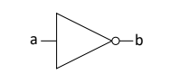
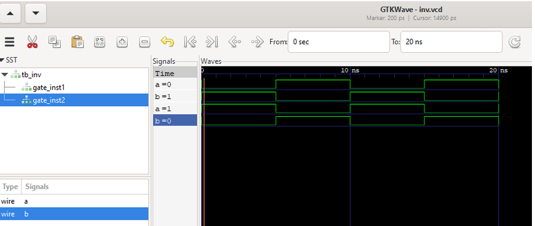

# 🔁 Inversor Digital em Verilog

Implementação de uma porta lógica inversora (NOT gate) utilizando Verilog HDL.

---

## 📌 Descrição
Este módulo realiza a inversão de um sinal digital de entrada, produzindo a saída complementar.  
É um dos blocos fundamentais da lógica digital e base para circuitos mais complexos.

---
## 🔌 Diagrama Lógico

Representação da porta lógica NOT.

  
</p>

---

## 🧠 Tabela Verdade da Porta Inversora

| Entrada (a) | Saída (b) |
|------------|----------|
| 0          | 1        |
| 1          | 0        |

---

## ⚙️ Testbench

O testbench instancia o módulo `inversor` e aplica estímulos de entrada para verificar a funcionalidade do inversor: entrada alternada entre 0 e 1,
com checagem automática da saída esperada, monitorando a saída para garantir que o circuito se comporta conforme a tabela verdade.

A simulação pode ser realizada em qualquer simulador Verilog (Icarus Verilog, ModelSim, Quartus, etc.)

---

## 🚀 Simulação com Icarus Verilog e GTKWave

Para simular o módulo Inversor:

```bash
# Compilar módulo + testbench
iverilog -o tb_inv.vvp inv.v tb_inv.v

# Executar simulação
vvp tb_inv.vvp

# Visualizar forma de onda
gtkwave inv.vcd
```
Confirmando a implementação correta da operação lógica NOT.

---
## 🧪 Simulação

<p align="center">
  
</p>

### 📊 Análise da Simulação

A forma de onda demonstra o comportamento esperado do inversor:

- Quando a entrada `a = 0`, a saída `b = 1`
- Quando a entrada `a = 1`, a saída `b = 0`

Confirmando a implementação correta da operação lógica NOT.

Este módulo é totalmente sintetizável e pode ser implementado em FPGA.

## 🎥 Demonstração em Vídeo

Vídeo curto demonstrando a simulação do inversor utilizando Icarus Verilog e GTKWave:

🔗 [Assistir demonstração](LINK_DO_VIDEO_AQUI)

