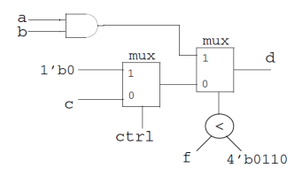
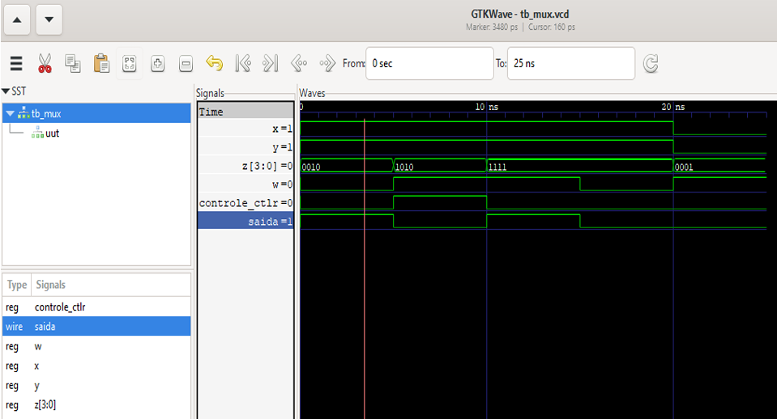

# 🔁 Multiplexador Condicional em Verilog

Implementação de uma lógica de seleção utilizando Verilog HDL, combinando operação lógica, comparação e controle condicional.

---

## 📌 Descrição
Este módulo implementa uma lógica semelhante a um multiplexador condicional, onde a saída depende de:

✅ Comparação entre o valor de f e 4'b0110

✅ Um sinal de controle ctrl

✅ Entradas lógicas a, b e c

A lógica funciona da seguinte forma:

1. **Se `f < 4'b0110`** → `saída d = a & b`
   → Realiza operação AND entre as entradas `a` e `b`

2. **Caso contrário, se `ctrl = 1`** → `saída d = 0`
  → Força a saída para nível lógico baixo

3. **Caso contrário** → `saída d = c`
   → Passa o valor da entrada `c` para a saída

Esse tipo de estrutura é comum em lógica combinacional de decisão em circuitos digitais.

---
## 🔌 Diagrama Lógico

Representação do circuito implementado.

<p align="left">  </p>

---

## ⚙️ Testbench

O testbench (tb_mux) foi desenvolvido para validar o comportamento do circuito através de diferentes cenários.

Os testes verificam:

✅ Comparação de f com 4'b0110

✅ Operação lógica a & b

✅ Comportamento quando ctrl = 1

✅ Seleção da entrada c

Durante a simulação:

• $monitor acompanha os sinais em tempo real

• $dumpfile e $dumpvars geram o arquivo de forma de onda .vcd

---
## 🔬 Casos de Testes

| Caso | f    | ctrl | a | b | c | Saída Esperada |
| ---- | ---- | ---- | - | - | - | -------------- |
| 1    | 0010 | 0    | 1 | 1 | 0 | 1              |
| 2    | 1010 | 1    | 1 | 1 | 1 | 0              |
| 3    | 1111 | 0    | 1 | 1 | 1 | 1              |
| 4    | 1111 | 0    | 1 | 1 | 0 | 0              |
| 5    | 0001 | 0    | 0 | 0 | 1 | 0              |

---

## 🚀 Simulação com Icarus Verilog e GTKWave

Para simular o módulo Inversor:

```bash
# Compilar módulo + testbench
iverilog -o tb_mux.vvp mux.v tb_mux.v

# Executar simulação
vvp tb_mux.vvp

# Visualizar forma de onda
gtkwave tb_mux.vcd
```
---

## 🧪 Simulação

<p align="center">
  
</p>

---

### 📊 Análise da Simulação

A simulação confirma o comportamento esperado:

• Quando f é menor que 0110, a saída depende da operação AND entre a e b.

• Quando f é maior ou igual e ctrl = 1, a saída é forçada para 0.

• Caso contrário, a saída assume o valor da entrada c.

Essa implementação demonstra controle condicional em lógica combinacional, conceito importante em projetos de FPGA e sistemas digitais.

---

## 🎥 Demonstração em Vídeo

Vídeo curto demonstrando a simulação do inversor utilizando Icarus Verilog e GTKWave:

🔗 [Assistir demonstração](https://youtu.be/Zb2pwTwXmS0)

