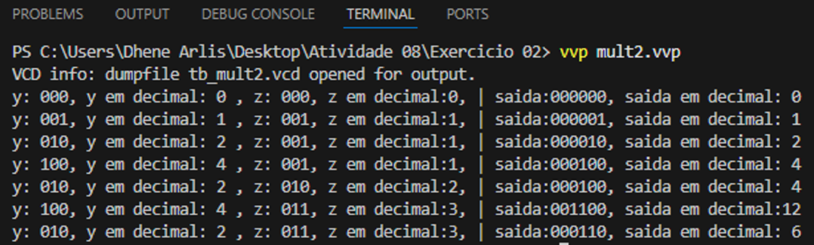
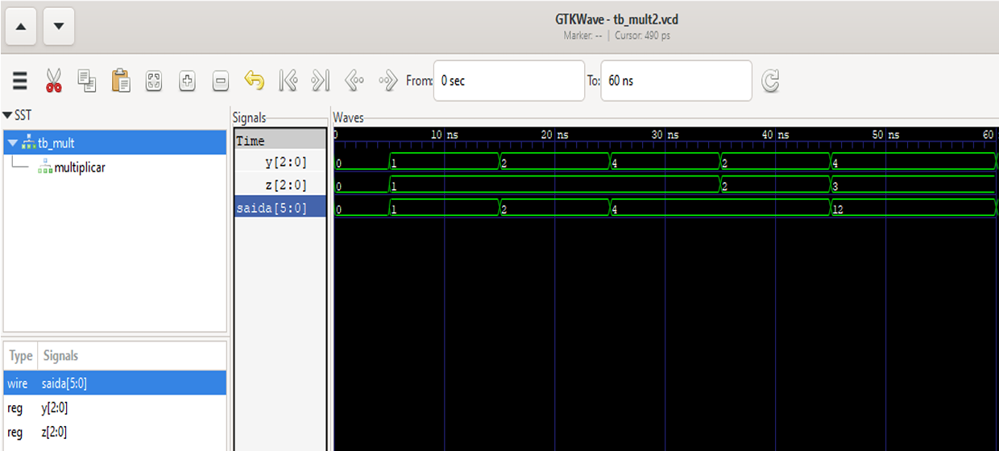

###  🔁 Multiplicador Digital (Versão Behavioral)

Implementação de um multiplicador digital utilizando Verilog HDL com modelagem behavioral (bloco always combinacional).

---

## 📌 Descrição
Este módulo realiza a multiplicação de dois sinais digitais de entrada (y e z), produzindo o resultado na saída saida. 
O projeto é parametrizável, permitindo ajustar a largura dos operandos através do parâmetro tamanho.

---

## 💻 Abordagem de Implementação

Modelagem Behavioral com always combinacional

🔹 Características Técnicas:

• **Bloco always combinacional:** A saída é recalculada sempre que há mudança nas entradas.

• **Parâmetro `tamanho:** Define a largura dos operandos (padrão = 3 bits).

• **Saída com o dobro de bits:** Para acomodar o resultado completo da multiplicação (2*tamanho bits).

• **Circuito puramente combinacional:** Sem elementos de memória ou clock, garantindo baixa latência.


✅ Vantagens para Hardware

**Resposta imediata:** Atualização contínua da saída.

**Síntese direta:** Facilmente implementável em FPGA ou ASIC.

**Flexibilidade:** Parâmetro ajusta a precisão sem modificar o código.

---

## ⚙️ Testbench

O testbench (tb_mult.v) instancia o módulo mult2 e aplica diversos estímulos de entrada para verificar a funcionalidade:

Estímulos com diferentes combinações de valores para y e z.

Monitoramento contínuo da saída via $monitor.

Geração de arquivo VCD (tb_mult2.vcd) para visualização de formas de onda.

A simulação pode ser realizada em qualquer simulador Verilog (Icarus Verilog, ModelSim, Quartus, etc.)


## 🚀 Simulação com Icarus Verilog e GTKWave

Para simular o módulo Multiplicador:

``` bash
# Compilar módulo + testbench (gera o .vvp)
iverilog -o mult2.vvp mult.v tb_mult2.v

# Executar simulação (usa o .vvp gerado)
vvp mult2.vvp

# Visualizar forma de onda
gtkwave mult2.vcd
```
---

## 🧪 Simulação no Visual Studio Code
<p> 
 
</p>

## 🧪 Simulação no GTKWave
<p> 
   
</p>

---

## 📊 Análise da Simulação
A simulação aplica os seguintes estímulos (para TAMANHO = 3 bits) conforme definido no testbench tb_mult2.v:

## Tabela de simulação

| Tempo (ns) | y (bin) | y (dec) | z (bin) | z (dec) | saída (bin) | saída (dec) | Operação |
|------------|---------|---------|---------|---------|-------------|-------------|----------|
| 0          | 000     | 0       | 000     | 0       | 000000      | 0           | 0 × 0 = 0 |
| 5          | 001     | 1       | 001     | 1       | 000001      | 1           | 1 × 1 = 1 |
| 15         | 010     | 2       | 001     | 1       | 000010      | 2           | 2 × 1 = 2 |
| 25         | 100     | 4       | 001     | 1       | 000100      | 4           | 4 × 1 = 4 |
| 35         | 010     | 2       | 010     | 2       | 000100      | 4           | 2 × 2 = 4 |
| 45         | 100     | 4       | 011     | 3       | 001100      | 12          | 4 × 3 = 12 |
| 60         | 010     | 2       | 011     | 3       | 000110      | 6           | 2 × 3 = 6 |

---
## Conclusão
A simulação confirma a implementação correta da multiplicação utilizando modelagem behavioral com bloco always combinacional. O módulo é parametrizável, sintetizável e adequado para implementação em FPGA, oferecendo uma solução flexível para operações aritméticas em sistemas digitais.

