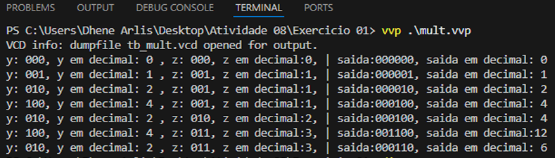
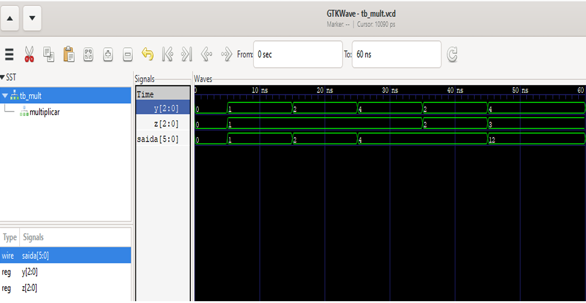

# 🔁 Multiplicador Digital

Implementação de um multiplicador digital utilizando Verilog HDL com modelagem **dataflow** (atribuição contínua).

---

## 📌 Descrição

Este módulo realiza a multiplicação de dois sinais digitais de entrada (y e z), produzindo o resultado na saída saida.
É um circuito aritmético fundamental para processamento digital e operações matemáticas em hardware.

---

## 💻 Abordagem de Implementação
Modelagem Dataflow com assign
Este projeto utiliza **atribuição contínua** (assign) para implementação do multiplicador, caracterizando uma abordagem de **modelagem dataflow**:

assign saida = y * z;


🔹 **Características Técnicas:**

- **Atribuição Contínua (assign):** Atualização automática da saída sempre que há mudança nas entradas  
- **Modelagem Dataflow:** Descrição do fluxo de dados entre sinais, sem necessidade de blocos `always`  
- **Circuitos Combinacionais:** Implementação puramente combinacional, sem elementos de memória  
- **Síntese Otimizada:** Permite que as ferramentas de síntese otimizem automaticamente a lógica Permite que as ferramentas de síntese otimizem automaticamente a lógica

 ✅ **Vantagens para Hardware**

- **Menor latência:** Resposta imediata às mudanças de entrada  
- **Código conciso:** Menor complexidade e maior legibilidade  
- **Síntese eficiente:** Ferramentas EDA otimizam automaticamente a implementação  
- **Sem clock necessário:** Circuito puramente combinacional  
- **Previsibilidade temporal:** Facilita análise de timing e propagação

---

## ⚙️ Testbench
O testbench instancia o módulo multiplicar e aplica diversos estímulos de entrada para verificar a funcionalidade do multiplicador:

• Testes com diferentes combinações de valores para y e z;

• Verificação automática do resultado da multiplicação;

• Monitoramento da saída para garantir que o circuito se comporta conforme esperado


A simulação pode ser realizada em qualquer simulador Verilog (Icarus Verilog, ModelSim, Quartus, etc.)

---
## 🚀 Simulação com Icarus Verilog e GTKWave

Para simular o módulo Multiplicador:

```bash
# Compilar módulo + testbench (gera o .vvp)
iverilog -o tb_mult.vvp mult.v tb_mult.v

# Executar simulação (usa o .vvp gerado)
vvp tb_mult.vvp

# Visualizar forma de onda
gtkwave tb_mult.vcd
```

---

## 🧪 Simulação no Visual Studio Code

<p>

</p>

---
## 🧪 Simulação no GTKWave

<p>

</p>


## 📊 Análise da Simulação

A forma de onda demonstra o comportamento esperado do multiplicador:
y[2:0]: Sinal de entrada de 3 bits (multiplicando)
z[2:0]: Sinal de entrada de 3 bits (multiplicador)
saida[5:0]: Resultado da multiplicação de 6 bits

Resultados observados na simulação:
y=1, z=1 → saida=1 (1×1=1) ✓
y=2, z=1 → saida=2 (2×1=2) ✓
y=4, z=1 → saida=4 (4×1=4) ✓
y=2, z=2 → saida=4 (2×2=4) ✓
y=4, z=3 → saida=12 (4×3=12) ✓
Confirmando a implementação correta da operação de multiplicação.
Este módulo é totalmente sintetizável e pode ser implementado em FPGA.
