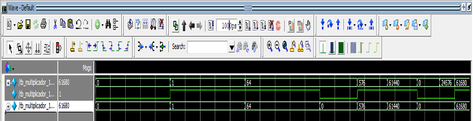

# 🔀 Multiplexador 16x1 (MUX 16:1)

Implementação comportamental de um multiplexador de 16 entradas para 1 saída, utilizando Verilog HDL. 
O módulo foi desenvolvido no **Quartus Prime** e simulado no **ModelSim**. 
O circuito seleciona um dos 16 bits de entrada com base em um sinal de seleção de 4 bits.

---

## 📌 Descrição

O multiplexador `mux_16x1` possui 16 entradas de dados (`entrada[15:0]`) e um seletor de 4 bits (`sel[3:0]`). A saída `saida` é igual ao bit da entrada correspondente ao valor binário do seletor. A descrição é feita de forma comportamental utilizando um bloco `always` combinacional com uma estrutura `case` que lista todas as 16 possibilidades de seleção.

O módulo é totalmente sintetizável e foi implementado em dispositivo FPGA (simulado no ModelSim).

---

## 🔌 Interface

| Porta     | Direção | Largura  | Descrição                             |
|-----------|---------|----------|-----------------------------------------|
| `entrada` | input   | `[15:0]` | Vetor de 16 bits de entrada             |
| `sel`     | input   | `[3:0]`  | Sinal de seleção (0 a 15)               |
| `saida`   | output  | `1`      | Bit de saída correspondente à seleção   |

---

## 🧠 Tabela de Seleção

| `sel` | Saída selecionada |
|-------|-------------------|
| 0000  | `entrada[0]`      |
| 0001  | `entrada[1]`      |
| 0010  | `entrada[2]`      |
| 0011  | `entrada[3]`      |
| 0100  | `entrada[4]`      |
| 0101  | `entrada[5]`      |
| 0110  | `entrada[6]`      |
| 0111  | `entrada[7]`      |
| 1000  | `entrada[8]`      |
| 1001  | `entrada[9]`      |
| 1010  | `entrada[10]`     |
| 1011  | `entrada[11]`     |
| 1100  | `entrada[12]`     |
| 1101  | `entrada[13]`     |
| 1110  | `entrada[14]`     |
| 1111  | `entrada[15]`     |
| outros| `entrada[0]` (default) |

---

## 🧪 Testbench (tb_mux_16x1)

O testbench instancia o módulo `mux_16x1` e aplica uma sequência de valores de teste. 
Para cada valor de `sel` de 0 a 15, o vetor `entrada` é configurado com um único bit ativo na posição correspondente. 
Dessa forma, a saída esperada é exatamente o valor desse bit (1 quando o bit ativo é o selecionado, 0 caso contrário).

### Estímulos aplicados:

| Tempo (ns) | `sel` | `entrada` (binário)          | Bit ativo |
|------------|-------|-------------------------------|-----------|
| 0          | 0000  | 0000_0000_0000_0000           | nenhum    |
| 5          | 0001  | 0000_0000_0000_0001           | 0         |
| 10         | 0010  | 0000_0000_0000_0010           | 1         |
| 15         | 0011  | 0000_0000_0000_0100           | 2         |
| 20         | 0100  | 0000_0000_0000_1000           | 3         |
| 25         | 0101  | 0000_0000_0001_0000           | 4         |
| 30         | 0110  | 0000_0000_0010_0000           | 5         |
| 35         | 0111  | 0000_0000_0100_0000           | 6         |
| 40         | 1000  | 0000_0000_1000_0000           | 7         |
| 45         | 1001  | 0000_0001_0000_0000           | 8         |
| 50         | 1010  | 0000_0100_0000_0000           | 9         |
| 55         | 1011  | 0000_1000_0000_0000           | 10        |
| 60         | 1100  | 0001_0000_0000_0000           | 11        |
| 65         | 1101  | 0010_0000_0000_0000           | 12        |
| 70         | 1110  | 0100_0000_0000_0000           | 13        |
| 75         | 1111  | 1000_0000_0000_0000           | 14        |

---

## 🚀 Simulação com Quartus e ModelSim

O projeto foi criado no **Quartus Prime** e a simulação comportamental executada no **ModelSim**, seguindo os passos:

A imagem abaixo mostra o resultado da simulação obtido no ModelSim:



*Forma de onda da simulação no ModelSim.*

---

## 📊 Análise da Simulação

A forma de onda gerada no ModelSim confirma o funcionamento correto do multiplexador. 
**O teste de simulação demonstra o funcionamento correto do Mux_16x1: em cada ciclo, a saída do multiplexador reflete com sucesso o valor lógico da entrada que está sendo selecionada pelo sinal de seleção `sel[3:0]`.**

### Comportamento observado:

- Quando `sel = 0000` e `entrada = 16'h0000`, a saída permanece em `0`.
- Quando `sel = 0001` e `entrada` tem o bit 0 ativo (`16'h0001`), a saída vai para `1`.
- Nos demais casos, enquanto o bit selecionado estiver ativo, a saída é `1`; caso contrário, é `0`.

As transições ocorrem exatamente nos instantes programados (a cada 5 ns), demonstrando a correta seleção do multiplexador para todas as combinações de `sel`.

---

## ⚙️ Estrutura Comportamental

O módulo utiliza um único bloco `always @(*)` com uma estrutura `case`:

```verilog
always @(*) begin
    case(sel)
        4'b0000: saida = entrada[0];
        4'b0001: saida = entrada[1];
        // ...
        4'b1111: saida = entrada[15];
        default: saida = entrada[0];
    endcase
end

```
---

## ✅ Conclusão
O multiplexador 16x1 foi implementado com sucesso em Verilog, utilizando uma descrição comportamental clara e sintetizável.
A simulação no ModelSim, a partir do testbench desenvolvido, permitiu verificar todas as combinações de seleção, comprovando que a saída assume corretamente o valor do bit de entrada correspondente a cada código de seleção aplicado.

A análise das formas de onda confirma que o circuito opera conforme a tabela verdade esperada, sem atrasos ou glitches, uma vez que se trata de lógica combinacional pura. Este módulo pode ser facilmente integrado em projetos maiores que necessitem de seleção de dados entre múltiplas fontes, como em unidades de processamento, sistemas de comunicação ou roteamento de sinais.

A utilização do Quartus Prime e ModelSim demonstra a portabilidade do código entre diferentes ferramentas de projeto, reforçando a robustez da implementação.
