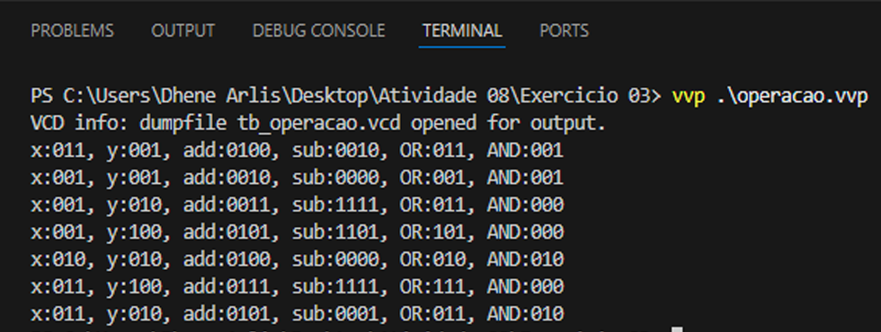
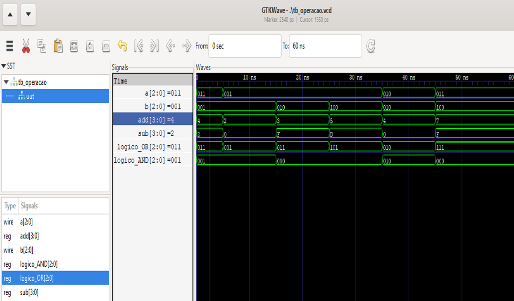

# 🔢 Módulo Operações Aritméticas e Lógicas

Implementação de uma unidade combinacional que realiza simultaneamente quatro operações entre dois vetores de entrada parametrizáveis: soma, subtração, OR bit a bit e AND bit a bit. 

---

## 📌 Descrição

O módulo `operacao` recebe dois vetores de entrada `a` e `b` de tamanho `tamanho` (parâmetro padrão = 3 bits) e fornece quatro saídas:

- `add` – resultado da soma (`a + b`), com um bit extra para o carry.
- `sub` – resultado da subtração (`a - b`), também com um bit extra (representação em complemento de dois).
- `logico_OR` – resultado do OR bit a bit entre `a` e `b`.
- `logico_AND` – resultado do AND bit a bit entre `a` e `b`.

Todas as operações são implementadas em blocos `always` distintos, que executam **concorrentemente**. 
Sempre que `a` ou `b` sofrem uma alteração, todos os blocos são acionados simultaneamente, atualizando as saídas de forma paralela e independente.

---

## ⚙️ Parâmetro

| Parâmetro | Descrição                    | Valor Padrão |
|-----------|------------------------------|--------------|
| `tamanho` | Largura dos vetores de entrada | 3            |

---

## 🔌 Interface

| Porta        | Direção | Largura               | Descrição                          |
|---------------|---------|-----------------------|--------------------------------------|
| `a`           | input   | `[tamanho-1:0]`       | Primeiro operando                   |
| `b`           | input   | `[tamanho-1:0]`       | Segundo operando                    |
| `add`         | output  | `[tamanho:0]`         | Soma (com carry)                    |
| `sub`         | output  | `[tamanho:0]`         | Subtração (com sinal estendido)     |
| `logico_OR`   | output  | `[tamanho-1:0]`       | OR bit a bit                        |
| `logico_AND`  | output  | `[tamanho-1:0]`       | AND bit a bit                       |

---

## 🧠 Tabelas Verdade das Operações Lógicas (para 1 bit)

### OR

| a | b | a OR b |
|---|---|--------|
| 0 | 0 |   0    |
| 0 | 1 |   1    |
| 1 | 0 |   1    |
| 1 | 1 |   1    |

### AND

| a | b | a AND b |
|---|---|---------|
| 0 | 0 |    0    |
| 0 | 1 |    0    |
| 1 | 0 |    0    |
| 1 | 1 |    1    |

---

## 🧪 Testbench (tb_operacao)

O testbench instancia o módulo `operacao` com `tamanho = 3` e aplica uma sequência de valores de teste às entradas `x` e `y`. A cada mudança, os resultados são monitorados no console e um arquivo VCD é gerado para visualização das formas de onda.

### Estímulos aplicados:

| Tempo (ns) | x    | y    |
|------------|------|------|
| 0          | 011  | 001  |
| 5          | 001  | 001  |
| 15         | 001  | 010  |
| 25         | 001  | 100  |
| 35         | 010  | 010  |
| 45         | 011  | 100  |
| 60         | 011  | 010  |

---
## 🚀 Compilar e simular

```bash
# Compilar os módulos e gerar o arquivo .vvp
iverilog -o operacao.vvp operacao.v tb_operacao.v

# Executar a simulação
vvp operacao.vvp

# Visualizar as formas de onda com GTKWave
gtkwave tb_operacao.vcd

```
---

## 🚀 Simulação com Icarus Verilog no VSCode



---

## 🚀 Simulação com GTKWave


