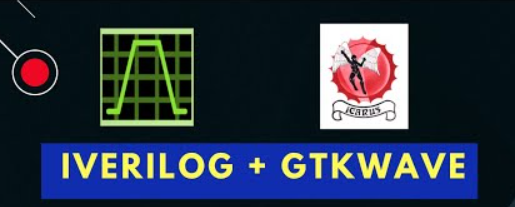
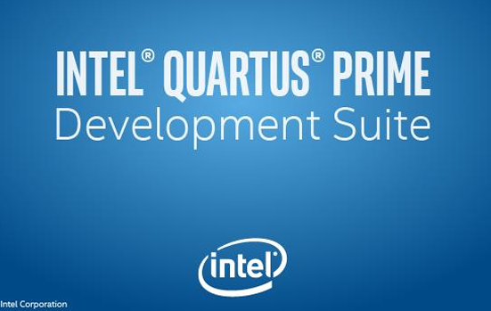

🚀 Digital Integrated Circuits Development using **Verilog HDL**

Repositório voltado ao desenvolvimento e modelagem de circuitos digitais com foco em aplicações industriais, FPGA e sistemas embarcados.

---

## 🎯 Objetivo

Este projeto tem como finalidade consolidar e demonstrar competências técnicas em:

- Lógica Combinacional
- Lógica Sequencial
- Modelagem e descrição de hardware em Verilog HDL
- Estruturação hierárquica e modular de projetos digitais
- Práticas alinhadas ao fluxo de desenvolvimento para FPGA

Este repositório compõe meu portfólio técnico na área de Engenharia Eletrônica e Sistemas Digitais.

---

## 🛠 Tecnologias e Ferramentas

  
  
  

- **Verilog HDL**
- **Icarus Verilog** – Simulação
- **GTKWave** – Análise de formas de onda
- **Intel Quartus Prime** – Síntese e implementação em FPGA
- Conceitos de Sistemas Digitais

---

## 📂 Estrutura do Projeto

O repositório contém implementações de módulos fundamentais utilizados na base de sistemas digitais:

### 🔹 Lógica Combinacional
- Half Adder
- Full Adder
- Comparador de 2 bits
- Decodificador
- Codificador
- Demultiplexador
- Código Gray
- Operações Aritméticas

### 🔹 Lógica Sequencial
- Contadores síncronos
- Circuitos baseados em Flip-Flops
- Estruturas sequenciais aplicadas a controle digital

---

## 📊 Aplicações Práticas

Os módulos desenvolvidos servem como base para:

- ALUs (Unidades Lógicas e Aritméticas)
- Arquiteturas de Processadores
- Sistemas Embarcados
- Projetos com FPGA
- Sistemas de Controle Digital
- Prototipagem de hardware

---

## 🌐 Conecte-se Comigo

👨‍💻 **Dhene Arlis**

🔗 LinkedIn: https://www.linkedin.com/in/dhene-arlis-4273511a8/  
💻 GitHub: https://github.com/cientistaarlis  
🌎 Portfólio (em breve): [Seu site Google aqui]

---

## 📌 Observação

- Documentação técnica individual por módulo
- Implementação completa de Testbenches

Este repositório possui caráter técnico-profissional e demonstra domínio prático na modelagem de hardware digital utilizando Verilog HDL, com foco em aplicações industriais e acadêmicas avançadas.
